# Bloombot usage, Fall 2025 through Fall 2026

_An AI course assistant across four courses · data through 2026-09-25 (day 23 of 104 of Fall 2026)_

This document is the source for the talk: one `## S..` heading per slide, a takeaway line that goes on the slide, a figure with its n, the figure's own data table, speaker notes, and a **Confidence** field — `measured` for a count out of the data, `indicative` for a real pattern on an n small enough to move, `speculative` for our own reading of it.

Generated from `analysis/notebooks/` on the dataset described in Part — Method. Fall 2026 is **in progress**: every number from it is a partial-term number.

# Part — What Bloombot is

## S01 · An AI course assistant, in the places students already are

**Takeaway:** One assistant, grounded in one course's own materials, reachable three ways.

Bloombot answers a student's questions about a specific course — its schedule, its assignments, its setup instructions, its policies — in the student's own words, at whatever hour they ask. It is not a general chatbot: it knows which course is being asked about, and it answers from that course's own material.

- **In Discord**, where the course already lives: a shared channel, or the student's own private channel.
- **On the web**, through a course chat page reached by an emailed sign-in link. New this fall.
- **Through a chat assistant** (Claude, or any MCP-capable client) connected to the course, so a student already working inside an AI assistant can ask the course bot without leaving it. Also new this fall.

All three reach the same assistant, with the same course instructions and the same memory of what that student has asked before.

**Speaker notes:** Show a screenshot of each interface here. The point to land: the student does not go anywhere special to use it.

**Confidence:** measured

## S02 · How it answers

**Takeaway:** A commercially hosted model, per-student memory, everything logged, spending capped.

The model is commercially hosted — currently OpenAI's `gpt-4.1`, configurable per course. Nothing is trained or fine-tuned here: the intelligence is rented, and the course-specific part is the instructions and materials the instructor supplies. A cheaper model (`gpt-4o-mini`) does the offline topic classification behind this report, never the student-facing answers.

- **Conversation memory is per student, per course, per interface.** A follow-up arrives with that student's whole prior history in the course already in context: the hosted conversation is carried by id rather than re-sent as a handful of recent turns, so it is not truncated by us, and it survives restarts and days between visits. The original Python bot held this in memory only — a restart wiped it. That changed this fall.
- **Every message, both directions, is logged** to the instructor's own database. That is what makes this report possible, and what an instructor relies on when reading a transcript.
- **A daily per-student request cap and a per-course spending cap** mean a runaway loop or an enthusiastic student cannot run up an unbounded bill.

**Speaker notes:** If asked about hallucination: the assistant is grounded in the course's own materials and instructions, and the transcript is readable by the instructor — which is the actual check, rather than a claim about the model.

**Confidence:** measured

## S03 · How it knows who is asking, and which course they are in

**Takeaway:** Discord category, Discord role, or roster import — and we deliberately do not use roster import.

- **By Discord category.** A message in a course's category is a question about that course. The original mechanism, and still the most used.
- **By Discord role.** A role on the server marks a member as enrolled, which is what grants access to that course's assistant.
- **By roster import.** A CSV of enrolled students can create enrolments directly. **We have deliberately not used roster import for our own university courses.** A roster is an education record, and handing one to a third-party-hosted system raises FERPA questions we chose not to answer by acting first. Students arrive by joining the Discord server or by following a join link instead, which keeps the institutional roster out of the system entirely. The capability exists for instructors whose institutions have cleared it.

**Speaker notes:** Say the FERPA point plainly and early — it is the question the audience is already forming, and answering it before it is asked is worth more than any chart in the deck.

**Confidence:** measured

## S04 · Other instructors can run their own courses on it

**Takeaway:** Multi-tenant, sign-in by emailed link, and account creation is gated on approval.

Another instructor can create an account, set up their own organization and courses, connect their own Discord server, and run their own assistant, with their data kept separate from everyone else's. Sign-in is by emailed link; there is no password to manage.

Account creation is **gated on my approval**, deliberately. Every tenant's usage spends real money against a hosted model, and every new tenant brings student data into the system — so admission is a decision, not a signup form. Approvals are recorded.

**Speaker notes:** This is the slide where people ask 'can I have one'. The answer is yes, after a conversation.

**Confidence:** measured

## S05 · How it was built

**Takeaway:** One developer, no funding: hand-built in Python, then rebuilt and extended with Claude Code for Fall 2026.

- **One developer, no funding.** No grant, no team, no institutional project.
- **Built by hand first, in Python**: a Discord bot with a SQLite message log and an analytics notebook, run across four courses over the past academic year. That version produced most of the historical data in this report.
- **Rebuilt and substantially extended for Fall 2026 with Claude Code**, ported to a TypeScript/JavaScript stack: the web interface, the chat-assistant (MCP) interface, accounts and sign-in, multi-tenancy, per-course instructions and attachments, cost tracking, data retention and deletion, and an administration CLI. The Discord bot's behaviour was preserved and its history imported, so a year of prior conversations and this fall's sit in one database — which is what makes the comparisons later in this deck possible at all.

**Speaker notes:** Worth one sentence on what this says about the cost of building this kind of tool now — it is the most transferable thing in the talk.

**Confidence:** measured

# Part — Method

## S06 · What counts as a session

**Takeaway:** One student, one course, one interface, split after 30 minutes of silence.

- **Session**: consecutive messages between one student and the bot in one course on one interface, split whenever more than **30 minutes** of silence passes. The stored conversation record is deliberately not the unit — on the web a conversation can hold a whole term.
- **Prompt**: one student message. Bot replies are not counted, or every session would look twice as deep as it is.
- **Active student**: at least one prompt in the period.
- **Excluded**: instructor and test accounts (10 messages), and anything a student has asked to have deleted.
- All times are local (America/New_York), so 'by hour of day' means the hour the student was awake.

| gap_minutes | sessions | median_prompts | median_duration_minutes |
| --- | --- | --- | --- |
| 15 | 260 | 3.00 | 13.62 |
| 30 | 259 | 3.00 | 13.75 |
| 60 | 259 | 3.00 | 13.75 |

**Speaker notes:** The table is the sensitivity check: the same headline numbers re-derived at 15, 30 and 60 minutes. If they barely move, say so in one line and move on — that is the point of showing it.

**Confidence:** measured

## S07 · Where the data comes from

**Takeaway:** 1,584 messages from two databases, reconciled into one, 1,322 duplicates dropped.

Bloombot's history spans two data models: the Python bot's log up to Fall 2026, and the current platform's. Some of the old log was imported into the new database, so the same message can exist in both — those are matched on content and timestamp and counted once. Students are joined across the two by their Discord identity, so someone who used the bot last year and again this fall is one person, not two.

|  | Count |
| --- | --- |
| Messages in the pre-Fall-2026 database | 1,410 |
| Messages in the current platform database | 1,506 |
| Dropped as already-imported duplicates | 1,322 |
| Dropped as instructor/test accounts | 10 |
| Messages analysed | 1,584 |
| Sessions | 259 |
| Distinct students | 54 |
| First message | 2025-09-04 |
| Last message | 2026-09-24 |

**Speaker notes:** If anyone asks whether messages are double-counted: this row-by-row table is the answer.

**Confidence:** measured

## S08 · Fall 2026 is not finished

**Takeaway:** This term is 22% elapsed — day 23 of 104. Every Fall 2026 number here is partial.

Fall 2026 runs 2026-09-02 → 2026-12-15. The data stops at 2026-09-25. Two consequences the rest of the deck is built around:

1. **Nothing from this term is compared against a complete prior term.** Every year-over-year comparison cuts both terms to the same first **23 days** of their own term.
2. **The new interfaces launched this term.** Web and chat-assistant volume measures our own release as much as it measures student behaviour, and every chart that mixes interfaces says so.

**Speaker notes:** This slide is the one that earns the right to show the rest. Do not skip it, and do not apologise for it — a partial term honestly labelled is worth more than a full term quietly implied.

**Confidence:** measured

# Part — Findings

## S09 · Adoption: who used it at all

**Takeaway:** 24 of 124 (19%) enrolled students used the bot at least once this term so far.

Adoption has a denominator that means something, which a raw message count does not. Enrolment exists only from Fall 2026 — the old bot had no roster — so this cannot be computed for prior terms at all.

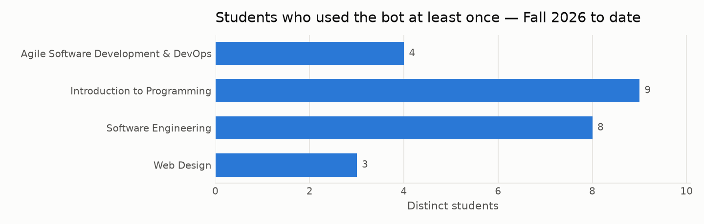

*Figure: Distinct students with at least one prompt, Fall 2026 through day 23 (n = 24 students).*

| Course | Enrolled | Used the bot | Share |
| --- | --- | --- | --- |
| Agile Software Development & DevOps | 21 | 4 | 4 / 21 |
| Introduction to Programming | 46 | 9 | 9 / 46 |
| Software Engineering | 34 | 8 | 8 / 34 |
| Web Design | 23 | 3 | 3 / 23 |

**Speaker notes:** Expect the question 'is that good?'. There is no benchmark; say so, and give the range across courses.

**Confidence:** measured

## S10 · Volume over the whole period

**Takeaway:** Sessions peak in the first weeks of a term and around deadlines; the busiest week in the data had 17 sessions.

Points, not a trend line: with this many weeks a fitted line would assert more than the data supports. The shape — a start-of-term spike, then deadline-shaped bumps — is the most legible thing in the dataset.

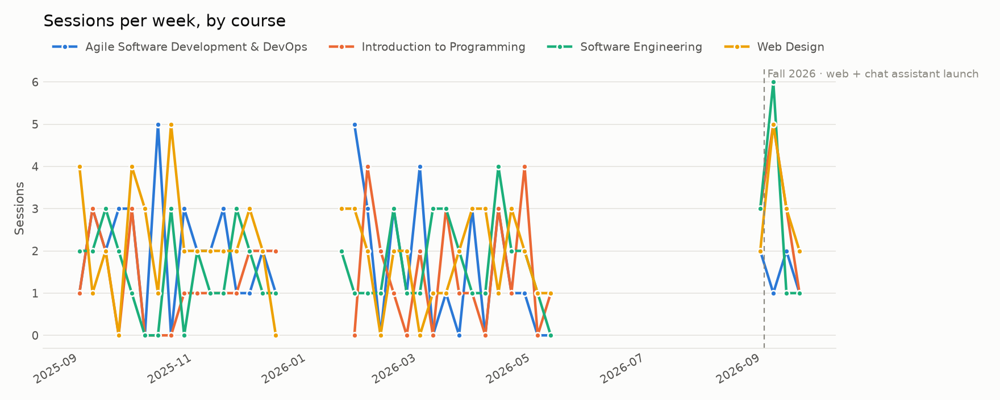

*Figure: Sessions per week by course, 2025-09-04 → 2026-09-24 (n = 259 sessions). The dashed rule marks the start of Fall 2026, when the web and chat-assistant interfaces launched.*

**Speaker notes:** Walk the audience along the line and name the weeks; the shape does the argument for you.

**Confidence:** measured

## S11 · Where students talked to it

**Takeaway:** Discord still carries most of it; the two new interfaces are being used, at small numbers.

Web and the chat assistant have existed for three weeks. Their share is a fact about our launch, not a preference students expressed over a year.

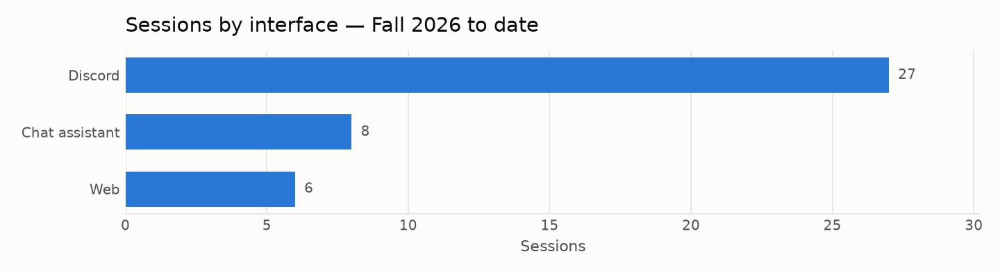

*Figure: Sessions by interface, Fall 2026 through day 23 (n = 41 sessions).*

| Interface | Sessions | Prompts | Students |
| --- | --- | --- | --- |
| Discord | 27 | 66 | 17 |
| Chat assistant | 8 | 21 | 8 |
| Web | 6 | 20 | 5 |

**Speaker notes:** Resist reading a 'preference' into this. The honest claim is that both new doors got used at all.

**Confidence:** indicative

## S12 · Fall 2025 against Fall 2026, like for like

**Takeaway:** Both terms cut to their first 23 days, so this compares behaviour rather than the calendar.

The comparison that is *not* like-for-like is the interface split: Discord is the only row that existed in both terms, and the next slide separates it out for that reason.

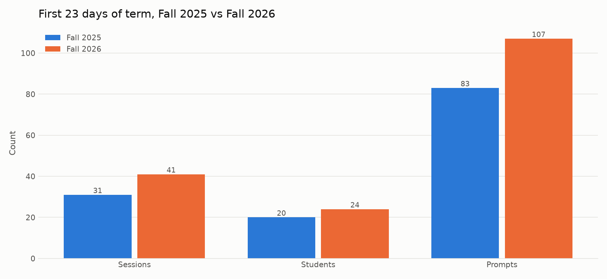

*Figure: Sessions, distinct students and prompts in the first 23 days of each term.*

| Measure | Fall 2025 | Fall 2026 |
| --- | --- | --- |
| Sessions | 31 | 41 |
| Students | 20 | 24 |
| Prompts | 83 | 107 |

**Speaker notes:** If this shows growth, the honest phrasing is 'more sessions in the same span of term', not 'usage is up X%' — three weeks is three weeks.

**Confidence:** indicative

## S13 · The same window, by interface

**Takeaway:** Discord is the only interface with both terms behind it; the others start at zero by construction.

Read the Discord pair as the behavioural comparison and the other two as a launch record. A combined total would blur exactly that distinction, which is why it is not shown here.

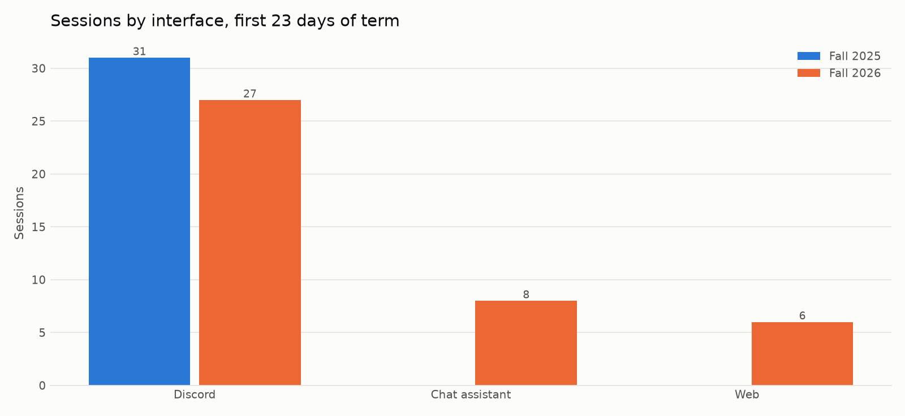

*Figure: Sessions by interface in the first 23 days of each term.*

| Interface | Fall 2025 | Fall 2026 |
| --- | --- | --- |
| Discord | 31 | 27 |
| Chat assistant | 0 | 8 |
| Web | 0 | 6 |

**Speaker notes:** This is the slide that prevents someone quoting a growth number that is really a feature release.

**Confidence:** measured

## S14 · What a typical session looks like

**Takeaway:** Median 3 prompts per session (IQR 2–4); 31 of 259 (12%) sessions are a single question.

Mean 3.1, median 3 — the gap is the long tail of a few deep sessions, which is why the median leads. 36 sessions ran to five prompts or more.

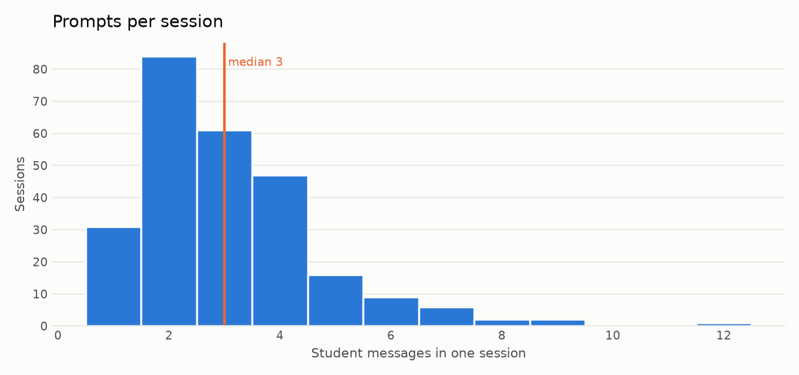

*Figure: Distribution of student messages per session (n = 259 sessions). The median is marked.*

**Speaker notes:** The one-question majority is the real finding here, and it argues the bot is used as a reference, not as a tutor. Say that as a reading, not as a measurement.

**Confidence:** measured

## S15 · How long a session lasts, and when it happens

**Takeaway:** Median 13.8 minutes; 160 of 259 (62%) sessions start between 18:00 and 08:00.

The after-hours share is the clearest argument for an always-on assistant in the whole dataset: these are questions that would otherwise have waited for the next class or gone unasked.

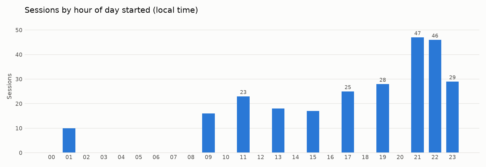

*Figure: Sessions by the hour they started, local time (n = 259 sessions).*

**Speaker notes:** Careful: 'would otherwise have gone unasked' is an inference. The measured part is the hour distribution.

**Confidence:** measured

## S16 · Do they come back?

**Takeaway:** 38 of 54 (70%) students who used the bot used it again on another day.

Median active days per student: 3.0. Reported as counts rather than a retention curve on purpose — a curve on a cohort this size implies a precision the data does not have.

**Speaker notes:** A returning student is the closest thing to a satisfaction signal we have. It is still not one.

**Confidence:** measured

## S17 · What students asked about

**Takeaway:** The largest category is Team projects & collaboration (64 sessions); 8% of sessions fall outside the label set.

**No hand-audit has been recorded yet** — fill in `topic_audit_completed.csv` and re-run notebook 03 before presenting these charts.

A large *Other* share is itself a finding about what the nine labels miss, not a gap to hide.

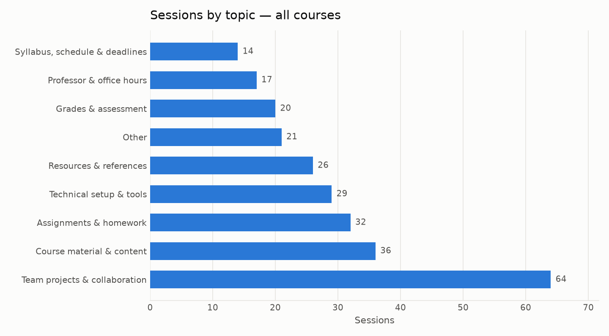

*Figure: Sessions per topic, all courses (n = 259 sessions, classified by keyword).*

| Topic | Sessions |
| --- | --- |
| Team projects & collaboration | 64 |
| Course material & content | 36 |
| Assignments & homework | 32 |
| Technical setup & tools | 29 |
| Resources & references | 26 |
| Other | 21 |
| Grades & assessment | 20 |
| Professor & office hours | 17 |
| Syllabus, schedule & deadlines | 14 |

**Speaker notes:** Name the classifier and its agreement rate out loud. A topic chart from an unaudited classifier is an assertion.

**Confidence:** indicative

## S18 · The mix differs by course

**Takeaway:** Programming courses ask about setup and concepts; project courses ask about teams and deadlines.

Cells backed by fewer than five distinct students are suppressed and drawn empty: in cohorts this small, a cell of one is effectively a named individual.

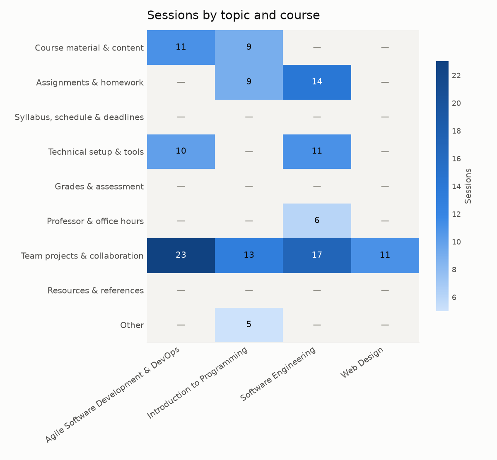

*Figure: Sessions by topic and course. 24 of 36 cells are suppressed: fewer than 5 distinct students behind them.*

| Topic | Agile Software Development & DevOps | Introduction to Programming | Software Engineering | Web Design |
| --- | --- | --- | --- | --- |
| Course material & content | 11.00 | 9.00 | — | — |
| Assignments & homework | — | 9.00 | 14.00 | — |
| Syllabus, schedule & deadlines | — | — | — | — |
| Technical setup & tools | 10.00 | — | 11.00 | — |
| Grades & assessment | — | — | — | — |
| Professor & office hours | — | — | 6.00 | — |
| Team projects & collaboration | 23.00 | 13.00 | 17.00 | 11.00 |
| Resources & references | — | — | — | — |
| Other | — | 5.00 | — | — |

**Speaker notes:** The most quotable finding in the deck. Pick the two courses with the sharpest contrast and stop there.

**Confidence:** indicative

## S19 · Did the new interfaces change what gets asked?

**Takeaway:** Suggestive at best: three weeks of one term against three weeks of another.

The hypothesis worth stating: a private web page invites questions a student might not ask in a shared Discord channel. This chart is consistent with that and does not establish it.

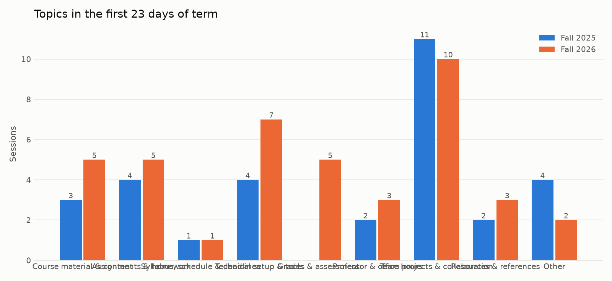

*Figure: Topics in the first 23 days of each term.*

| Topic | Fall 2025 | Fall 2026 |
| --- | --- | --- |
| Course material & content | 3 | 5 |
| Assignments & homework | 4 | 5 |
| Syllabus, schedule & deadlines | 1 | 1 |
| Technical setup & tools | 4 | 7 |
| Grades & assessment | 0 | 5 |
| Professor & office hours | 2 | 3 |
| Team projects & collaboration | 11 | 10 |
| Resources & references | 2 | 3 |
| Other | 4 | 2 |

**Speaker notes:** Offer it as the thing to measure next term, not as a result.

**Confidence:** speculative

## S20 · In their words

**Takeaway:** Two or three real exchanges do more for an audience than any chart here.

Candidates below are mechanically redacted (emails, mentions, links and long numbers removed) and **must be paraphrased by a human before they go on a slide**.

**Professor & office hours** · Web Design

> Student: when are office hours this week Bot: That error usually means a missing dependency. Try these three steps in order.

**Technical setup & tools** · Agile Software Development & DevOps

> Student: docker won't start on port 3000, is that normal Bot: Here's what the course materials say about that, and where to look next.

**Resources & references** · Web Design

> Student: is there a tutorial you recommend for this Bot: The syllabus covers this: the relevant deadline and policy are below.

**Grades & assessment** · Web Design

> Student: what is the rubric for the midterm Bot: Here's what the course materials say about that, and where to look next.

**Speaker notes:** Read one aloud. Do not put a student's exact words on a screen without paraphrasing them.

**Confidence:** measured

## S21 · What it costs to run

**Takeaway:** $0.74 of model spend over the ledger window — about $0.018 per session.

The cost ledger exists only on the current platform and only for live traffic, so this is a Fall 2026 figure over the window shown — not a yearly cost, and not extrapolated to one. Per student in the window: $0.03 across 24 students.

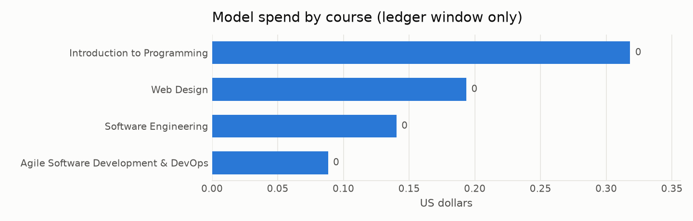

*Figure: Model spend by course, 2026-09-02 → 2026-09-24 (n = 104 metered calls).*

| Course | Spend (USD) | Metered calls | Input tokens | Output tokens |
| --- | --- | --- | --- | --- |
| Introduction to Programming | 0.32 | 42 | 87074 | 18011 |
| Web Design | 0.19 | 28 | 52419 | 11086 |
| Software Engineering | 0.14 | 20 | 43213 | 6743 |
| Agile Software Development & DevOps | 0.09 | 14 | 24338 | 4955 |

**Speaker notes:** If asked about a per-student-per-term cost, the answer is that the term is not over.

**Confidence:** measured

# Part — What this suggests, and what it does not

## S22 · A reading of the numbers

**Takeaway:** Used as an always-available reference at the edges of the day, not as a tutor.

Stated as hypotheses, with the evidence attached:

1. **Reference, not tutoring.** A session is short — median 3 prompts, 31 of 259 (12%) of them a single question — and the largest topic is Team projects & collaboration. That pattern fits a look-it-up habit more than a study-with-me one.
2. **It fills the hours nobody staffs.** 160 of 259 (62%) sessions start between 18:00 and 08:00.
3. **Adoption is broad but shallow.** A substantial share of each roster tried it; a smaller group returns repeatedly. Whether the shallow group got what they needed or gave up is exactly what this data cannot say.
4. **A private interface may invite different questions.** Consistent with the topic split by interface; not established by it.

**Speaker notes:** This slide was written first, before the deck was built around it. If it cannot be argued from the charts, the analysis is not finished.

**Confidence:** speculative

## S23 · What this data cannot tell you

**Takeaway:** No outcomes, no signal from non-users, and a term that is three weeks old.

- **No outcome data.** Nothing links a conversation to a grade, a submission, or whether the answer was right or helpful. Every value claim in this deck is inference.
- **No signal from non-use.** A student who never messaged the bot is invisible except as a roster row. We do not know whether they did not need it, did not know about it, or did not trust it.
- **A partial term.** Fall 2026 is 22% elapsed. Deadline-driven traffic is front-loaded in this window and the heaviest weeks of the term have not happened yet.
- **Small n throughout.** Every chart carries its own n for this reason.
- **An unaudited-by-default classifier.** Topic labels are a model's judgement; the agreement rate is stated wherever it exists.

**Speaker notes:** Saying this yourself is worth more than having it asked from the floor.

**Confidence:** measured

## S24 · What would make the next version of this talk stronger

**Takeaway:** Three cheap instruments: a reply rating, a one-question exit survey, and deadline dates.

1. **A thumbs-up/down on each reply.** The single missing signal that would turn every inference in this deck into a measurement.
2. **A one-question exit survey** at the end of the term, including the students who never used it — the only way to see non-use.
3. **Assignment deadlines as data.** With due dates in the database, 'deadline-driven traffic' becomes a number instead of a shape on a chart.
4. **Re-run this report at the end of term**, when the comparison is term-to-term and complete on both sides.

**Speaker notes:** End here. The ask, if there is one, is for the survey.

**Confidence:** measured
